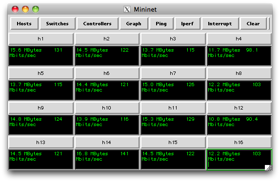

**Welcome to Mininet**
=======================

Mininet creates scalable (up to hundreds of nodes, depending on your configuration) software-defined (e.g. [http://openflow.org !OpenFlow](Http://Openflow.Org!OpenFlow.html)) networks on a single PC by using Linux processes in network namespaces.

It allows you to quickly [create](MininetSampleWorkflow#Creating_a_Network), [interact with](MininetSampleWorkflow#Interacting_with_a_Network), [customize](MininetSampleWorkflow#Customizing_a_Network) and [share](MininetSampleWorkflow#Sharing_a_Network) a software defined network prototype, and provides a smooth path to [running on hardware](MininetSampleWorkflow#Running_on_Hardware).

<!-- BL: not sure about this stuff: 
As a "network laboratory on a laptop", Mininet can run full Unix network applications, and includes a CLI and API for creating and interacting with the virtual network.
><cite>>> Ready to get going? Jump to the [GettingStarted](MininetGettingStarted) page.</cite>
-->

**To download Mininet and get started, go to the [MininetGettingStarted](MininetGettingStarted) page.**

Mininet's source code is hosted on !GitHub at <http://github.com/mininet/mininet.>

Alternately, you may wish to **[learn more about Mininet](MininetLearnMore)** or peruse the **[Mininet Documentation](MininetDocumentation).**

Please direct any Mininet-specific questions to our helpful [mininet-discuss mailing list](https://mailman.stanford.edu/mailman/listinfo/mininet-discuss) ash; NOT to nox-dev, ovs-discuss, or openflow-discuss.

Have fun with Mininet!!